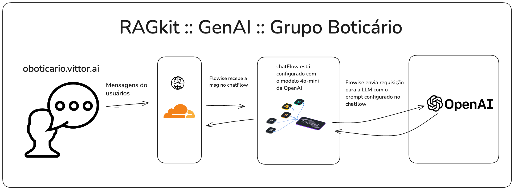
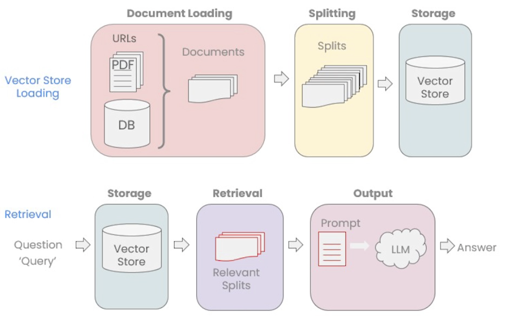

# RAGKit :: Flowise ChatFlow + Postgres Vector DBs

Este projeto demonstra a implementação da técnica **Retrieval Augmented Generation (RAG)** utilizando o [Flowise](https://flowiseai.com/) para a orquestração do fluxo de chat, o [PostgreSQL](https://www.postgresql.org/) com a extensão [PGVector](https://github.com/pgvector/pgvector) para o armazenamento e busca de embeddings vetoriais e o framework LangChain para geração das embeddings.

O objetivo principal é construir um sistema de chatbot inteligente capaz de responder a perguntas relevantes sobre um determinado conteúdo(no exemplo, o livro a Origem das Espécias), utilizando a técnica RAG para aprimorar as respostas com informações contextuais precisas e atualizadas.



## Estratégia RAG Implementada

Este projeto utiliza a estratégia **Retrieval Augmented Generation (RAG)** para criar um chatbot mais inteligente e informacionalmente rico. O RAG permite que o modelo de linguagem (LLM) consulte uma base de dados de conhecimento externa (neste caso, um banco de dados vetorial PostgreSQL) para **recuperar informações contextuais relevantes** no momento da geração da resposta.

**Etapas principais do fluxo com RAG implementado:**



1.  **Criação de Embeddings Vetoriais(Vector Store Loading):**
    *   O conteúdo de um documento de texto (por exemplo, o livro "A Origem das Espécies") é carregado e dividido em chunks menores.
    *   Para cada chunk de texto, são gerados embeddings vetoriais utilizando um modelo de embeddings da OpenAI (`text-embedding-3-small`). Alternativamente, poderá utilizar modelos Open-Source (`SimCSE`, `SBERT`) para reduzir custos ou até mesmo modelos mais caros como `text-embedding-ada-002` para trazer mais qualidade. 
    *   Estes embeddings, juntamente com os chunks de texto originais e metadados (como um hash do conteúdo), são armazenados num banco de dados vetorial PostgreSQL (utilizando PGVector).
    *   **Script:** `src/vector_store_builder.py` é responsável por este processo.

2.  **ChatFlow no Flowise para Consultas RAG(Retrivial):**
    *   Um chatflow no Flowise é configurado para receber perguntas do utilizador.
    *   Quando uma pergunta é recebida:
        *   É gerado um embedding vetorial para a pergunta do utilizador, utilizando o mesmo modelo de embeddings da OpenAI(`text-embedding-3-small`).
        *   Este embedding da pergunta é usado para realizar uma **busca de similaridade no banco de dados vetorial PostgreSQL**, procurando os chunks de texto que são semanticamente mais relevantes para a pergunta.
        *   Os chunks de texto mais relevantes recuperados do banco de dados vetorial são **inseridos como contexto adicional** no prompt enviado para um modelo de linguagem grande (LLM) como `GPT-4` ou `GPT-4o mini`.
        *   O LLM, agora com o contexto adicional recuperado da base de dados vetorial, gera uma resposta à pergunta do utilizador, baseando-se tanto no seu conhecimento prévio como na informação contextual fornecida pelo RAG.
    *   **Chatflow Exemplo:** Um exemplo de chatflow já configurado para RAG está disponível no arquivo [`flowise/Case O Boticário __ GenAI __ RAG Chatflow.json`](flowise/Case%20O%20Botic%C3%A1rio%20__%20GenAI%20__%20RAG%20Chatflow.json).

**Vantagens da Estratégia RAG neste Projeto:**

*   **Respostas Aprimoradas e Contextualizadas:** O RAG permite que o chatbot forneça respostas mais precisas, relevantes e contextualmente ricas, pois baseia-se em informações específicas recuperadas de uma base de conhecimento externa, em vez de depender apenas do conhecimento geral pré-existente no LLM.
*   **Acesso a Conhecimento Específico e Atualizado:** Ao utilizar um banco de dados vetorial com embeddings do conteúdo desejado, o chatbot pode aceder e usar informações específicas de um domínio ou base de conhecimento particular (neste caso, o livro "A Origem das Espécies"). Isto é crucial para responder a perguntas que requerem conhecimento especializado ou acesso a dados que mudam ao longo do tempo.
*   **Redução de "Alucinações" ou Respostas Imprecisas:** Ao fundamentar as respostas em documentos recuperados, o RAG ajuda a reduzir a probabilidade de o LLM gerar respostas imprecisas, inventadas ou "alucinatórias", pois o modelo tem uma base de conhecimento concreta para se apoiar.

## Resumo das principais tecnologias utilizadas no projeto:

* **Python**: Linguagem de programação principal.
* **Flowise**: Plataforma para orquestração de chat.
* **PostgreSQL**: Banco de dados para armazenamento dos embeddings.
* **OpenAI API**: Geração dos embeddings (modelos: `text-embedding-3-small` ou `text-embedding-ada-002`).
* **LangChain**: Framework para manipulação de documentos e embeddings.


# Montando o ambiente para rodar o projeto localmente

## Pré-requisitos
Antes de executar o projeto, certifique-se de que tem os seguintes pré-requisitos instalados e configurados:
1.  **Python 3+**
2.  **Conta OpenAI e Chave API:**  Necessária para usar os modelos de embedding e linguagem da OpenAI. Crie uma conta no [site da OpenAI](https://www.openai.com/) e gere uma chave API.
3.  **Variáveis de Ambiente Configuradas:**
    *   Use o [.env.exemple](docs/env.exemple) ou crie um arquivo `.env` na raiz do projeto e configure as seguintes variáveis de ambiente:

        ```env
        OPENAI_API_KEY=sua_chave_api_openai_aqui
        DB_USER=postgres
        DB_PASSWORD=postgres
        DB_HOST=localhost
        DB_PORT=5432
        DB_NAME=rag_db # Nome do banco de dados para os embeddings
        DB_DEFAULT_NAME=postgres # Banco de dados padrão do Postgres para operações de setup
        ```

        **Nota:** Substitua `sua_chave_api_openai_aqui` pela sua chave API da OpenAI e ajuste as configurações do banco de dados PostgreSQL (`DB_USER`, `DB_PASSWORD`, `DB_HOST`, `DB_PORT`, `DB_NAME`, `DB_DEFAULT_NAME`) de acordo com o seu ambiente local ou de servidor.
4.  **PostgreSQL (com extensão para vetores configurada)** [Guia de Instalação](https://www.postgresql.org/docs/current/tutorial-install.html)
* Flowise instalado (consulte a documentação oficial) [Guia de Instalação](https://docs.flowiseai.com/getting-started)
    **Nota:** O Flowise, por padrão, utiliza o banco de dados em memória. Para usar o Flowise com o PostgreSQL (ou outro banco de dados) para persistência dos dados do Flowise (chatflows, configurações, etc.), consulte a [documentação do Flowise sobre configuração de bancos de dados](https://docs.flowiseai.com/configuration/databases). No contexto deste projeto RAG *especificamente para o banco de dados vetorial*, os embeddings serão sempre armazenados no PostgreSQL, independentemente da configuração de banco de dados do Flowise.

## Executar os modulos Python para gerar o banco de dados vetorial com os embeddings

Para preparar o ambiente do banco de dados vetorial PostgreSQL e gerar os embeddings do documento, execute os seguintes modulos Python na ordem indicada.

1.  **Clonar repositório**
    ```bash
    # 
    git clone https://github.com/vittor-rio/RAGKit.git
    cd ragkit
    ```

2.  **Instale as Dependências:**
    ```bash
    pip install -r requirements.txt
    ```

3.  **Configurar o Banco de Dados Vetorial PostgreSQL:**

    Para criar ou validar o banco de dados para armazenar os embeddings vetoriais:

    ```bash
    python src/config/database_setup.py
    ```

    Este modulo irá conectar-se ao PostgreSQL utilizando as configurações definidas no arquivo `.env`, criar o banco de dados `rag_db` (se ainda não existir).

4.  **Gerar e Carregar Embeddings Vetoriais:**

    Para processar o documento de texto, dividir em chunks, gerar embeddings usando a OpenAI API e persistir no banco de dados PostgreSQL, execute:

    ```bash
    python src/main.py
    ```

    **Nota:** Certifique-se de que a variável de ambiente `OPENAI_API_KEY` está corretamente configurada no seu arquivo `.env` antes de executar este script, pois ele irá interagir com a API da OpenAI para gerar os embeddings.

    O arquivo de texto padrão utilizado para gerar os embeddings é o livro "A Origem das Espécies" (`data/theOriginOfSpecies.txt`). Pode substituir este arquivo por qualquer outro documento de texto que deseje usar como base de conhecimento para o seu chatbot RAG, simplesmente alterando o caminho para o arquivo de texto na variável `content_path` no `main.py`.

## Importar o Chatflow de Exemplo para o Flowise

Para experimentar o chatflow RAG de exemplo já configurado:

1.  **Acesse a interface web do Flowise** (`http://localhost:3000`, por padrão).
2.  No Flowise, navegue até à seção de **Chatflows**.
3.  Clique no botão **Import Chatflow** e selecione o arquivo [`flowise/Case O Boticário __ GenAI __ RAG Chatflow.json`](flowise/Case%20O%20Botic%C3%A1rio%20__%20GenAI%20__%20RAG%20Chatflow.json) do seu sistema de arquivos.
4.  O chatflow de exemplo será importado para o seu Flowise. Pode então editá-lo, configurá-lo e testá-lo diretamente na interface do Flowise.

Com estes passos, terá o ambiente configurado, o banco de dados vetorial populado com embeddings do documento de texto, e um exemplo de chatflow RAG pronto para ser utilizado no Flowise. Pode agora começar a interagir com o seu chatbot RAG e explorar as capacidades da técnica RAG implementada neste projeto.

## Licença

Este projeto está licenciado sob a [MIT License](https://opensource.org/licenses/MIT).
