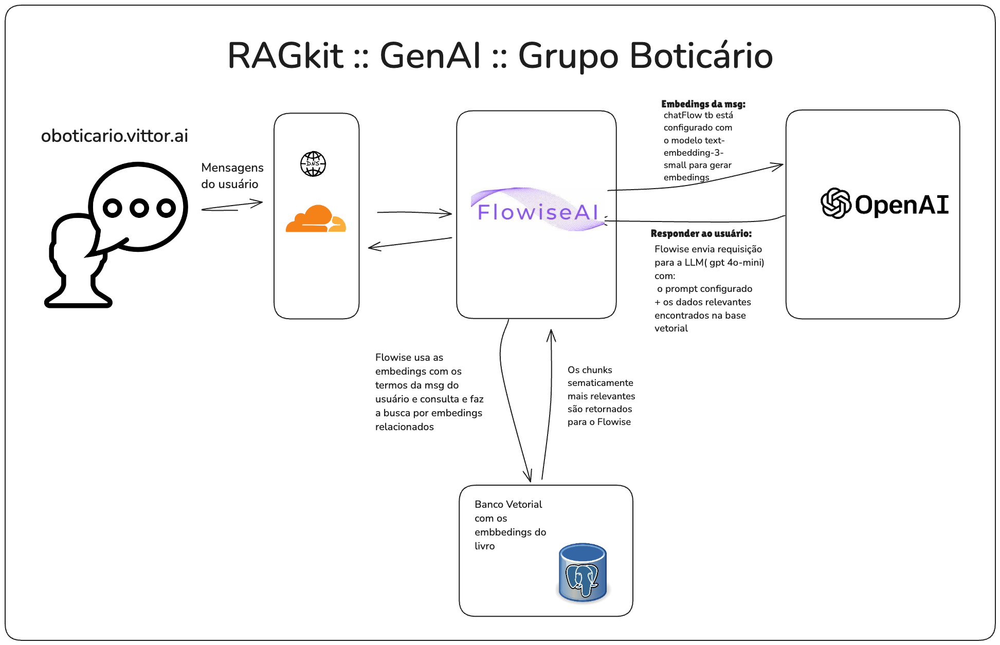

# RAGKit :: Flowise ChatFlow + Postgres Vector DBs

Neste projeto, vamos usar o Flowise para orquestração e o banco de dados Postgres para armazenamento dos vetores de embedding. O conteúdo utilizado nos vetores pode ser definido de acordo com o seu projeto, como exemplo, no código deste projeto, estaremos utilizando o livro _A Origem das Espécies_.

## Configure o Flowise

- [Guia de Instalação](https://docs.flowiseai.com/getting-started): Instruções para configurar o Flowise em sua máquina local.

- [Fazer a configuração do Postgres(ou equivalente)](https://docs.flowiseai.com/configuration/databases): Orientações sobre como conectar sua instância do Flowise a diferentes tipos de bancos de dados.

Para garantir a segurança ao expor o Flowise publicamente, é essencial habilitar a autenticação. A documentação oficial do Flowise fornece orientações detalhadas sobre como configurar a autenticação em nível de aplicativo e de chatflow.

### Exemplo de Configuração de um ChatFlow no Flowise

O arquivo [`flowise/Case O Boticário __ GenAI __ RAG Chatflow.json`](flowise/Case%20O%20Botic%C3%A1rio%20__%20GenAI%20__%20RAG%20Chatflow.json) contém um exemplo de configuração de um chat que implementa a técnica de **RAG** utilizando uma base de vetores no PostgreSQL. Este exemplo demonstra como integrar o Flowise com um banco de dados vetorial para aprimorar as respostas do chat.

Para garantir a segurança ao expor o Flowise publicamente, é essencial habilitar a autenticação. A documentação oficial do Flowise fornece orientações detalhadas sobre como configurar a autenticação em nível de aplicativo e de chatflow.

## Retrieval augmented generation(RAG)

RAG é uma técnica que combina modelos de LLMs com mecanismos de recuperação de informações. Nessa abordagem, o modelo recupera documentos contextuais de um conjunto de dados externo durante sua execução, utilizando essas informações para aprimorar a geração de respostas. Isso permite que o modelo acesse dados atualizados e específicos de um domínio, melhorando a precisão e relevância das respostas fornecidas.  
